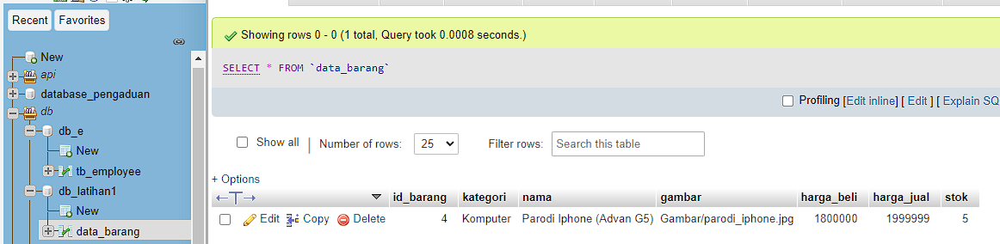
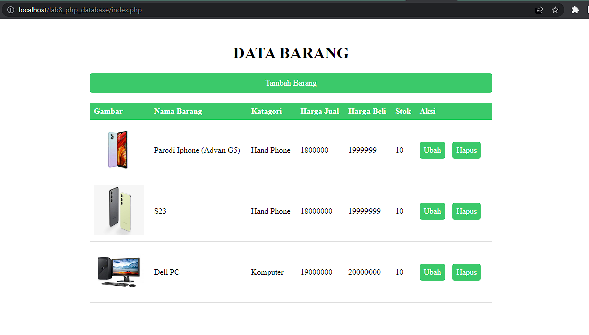
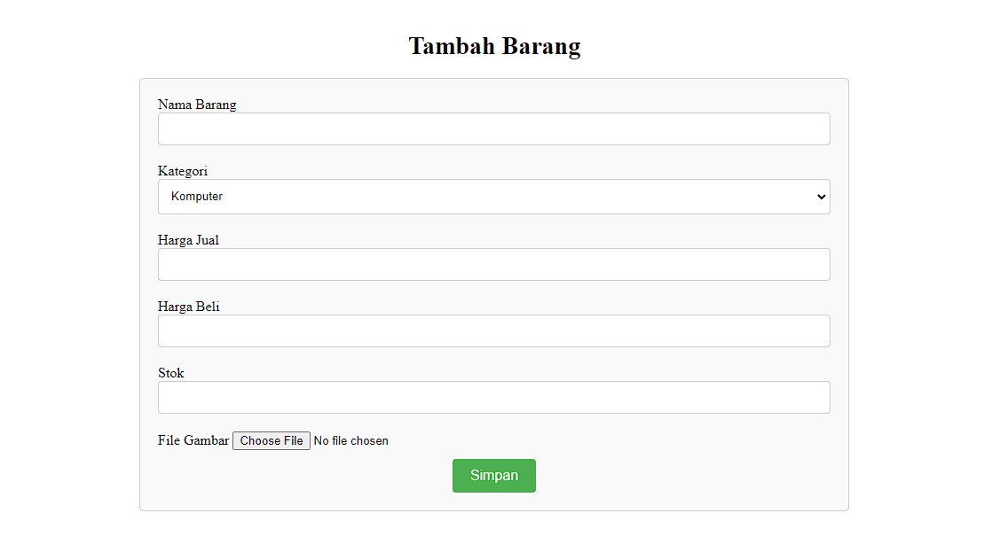
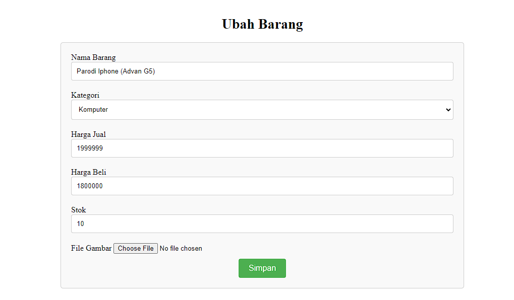

# PHP-Database
# PHP-Dasar

This project is an assignment from my class
#### NIM : 312110103
#### Kelas : TI.21.A2
#### MatKul : Pemrograman Weh 2

### Latihan
Ini adalah Latihan Web Database CRUD 
### Database

Tampilan Awal yang menampilkan menu read Dan Button Tambah, Ubah, Dan Hapus

Tamilah Tambah Data

Tampilan Ubah Data

